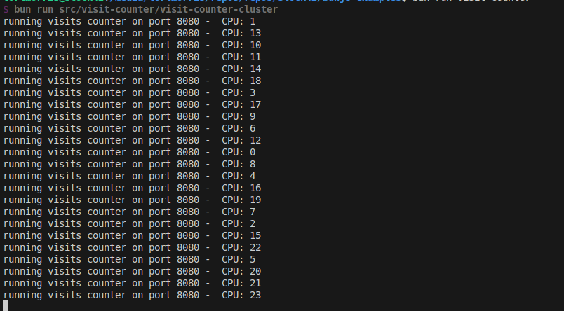
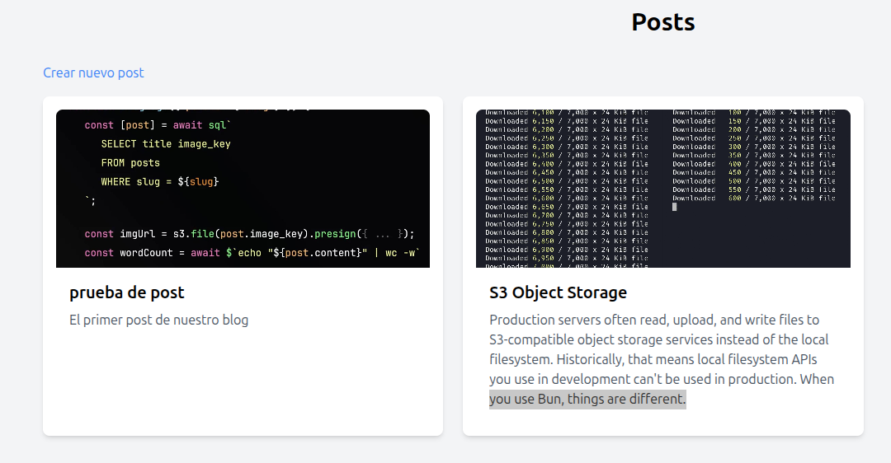
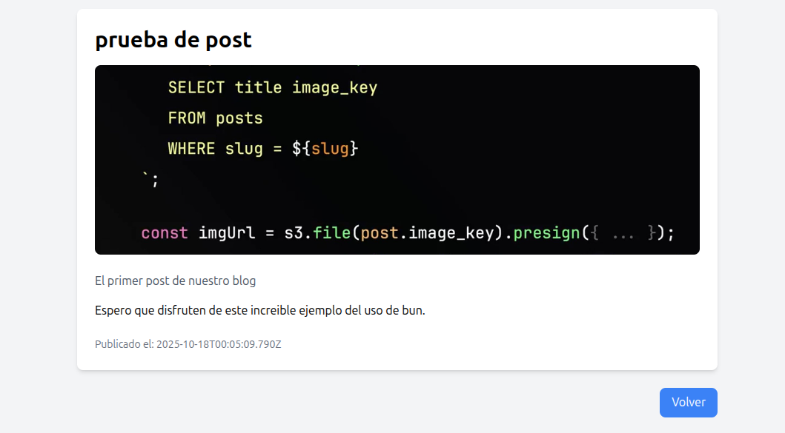

# Bun.js Examples Repository


This repository contains a collection of practical examples showcasing the power and simplicity of Bun.js, including a clustered visit counter and a lightweight blog. Created by [César Casas](https://www.linkedin.com/in/cesarcasas/) at [Stock42](https://stock42.com).

[](https://bun.sh)

[](https://www.typescriptlang.org/)

[](https://opensource.org/licenses/MIT)

[](https://github.com/stock42/bunjs-examples/stargazers)

[](https://github.com/stock42/bunjs-examples/watchers)

[](https://github.com/stock42/bunjs-examples/network)

# Table of Contents

- [Installation](#installation)
- [Examples](#examples)
- [Contributing](#contributing)
- [License](#license)
- [Contact](#contact)

# About

This repository is designed to highlight the versatility and performance of Bun.js through concise, functional examples. Each example showcases different aspects of Bun, such as its native support for TypeScript, clustering, and integration with tools like Redis, SQLite, and AWS S3. Whether you're a beginner or an experienced developer, these examples provide practical insights into building modern web applications with Bun.

Current examples include:

- Visit Counter: A scalable visit counter using Bun's clustering and native Redis integration.
- Blog: A lightweight blog powered by HTML, SQLite, and AWS S3 for asset storage.

## Installation

To get started, ensure you have Bun.js installed. Then, clone the repository and install dependencies:

```bash
git clone https://github.com/stock42/bunjs-examples.git
cd bunjs-examples
bun install
```

# Examples

## visit-counter

This example shows how to create a visit counter using bunjs, using cluster.
For run this example, you need to have bunjs and redis installed.



To run:

```bash
bun src/visit-counter/visit-counter-cluster.ts
```

To test (you need to have autocannon installed):

```bash
./src/visit-counter/test.sh
```

## blog

This example shows how to create a blog using bunjs, using sqlite and s3.
For run this example, you need to have bunjs and redis installed.

For run this example, you need to have a S3 bucket.
Remember add the follow environment variables before run the example (you can add them to your .env file):





```bash
export AWS_BUCKET=your-bucket-name
export AWS_REGION=your-bucket-region
export AWS_SECRET_ACCESS_KEY=your-bucket-secret-access-key
export AWS_ACCESS_KEY_ID=your-bucket-access-key-id
```

To run:

```bash
bun src/blog/index.ts
```

now, open the browser and go to http://localhost:8080

# Contributing

Contributions are welcome!
To add a new example or improve existing ones:

- Fork the repository.
- Create a new branch (git checkout -b feature/new-example).
- Add your example in the src directory with clear documentation.
- Update the README with the new example details.
- Submit a pull request.

Please ensure your code follows the project's style (use bun run format and bun run lint) and includes tests where applicable.
Report issues or suggest features via the GitHub Issues page.

# License

This project is licensed under the MIT License (LICENSE).

# Contact

Created by [César Casas](https://www.linkedin.com/in/cesarcasas/) at [Stock42](https://stock42.com). For questions or feedback, open an issue on GitHub or reach out via LinkedIn.
